# Snake — PwnSec CTF 

**Auteure :** Kaoutar Menacera  
**Niveau :** Hard  
**Catégorie :** Android Reverse Engineering  
**Flag :** `PWNSEC{W3'r3_N0t_T00l5_0f_The_g0v3rnm3n7_0R_4ny0n3_3ls3}`

---

## Vue d'ensemble

Ce challenge Android nous demande de contourner plusieurs mécanismes de protection intégrés dans l'application, puis d'exploiter la vulnérabilité **CVE-2022-1471** présente dans la bibliothèque SnakeYAML pour déclencher l'exécution d'une méthode JNI native qui produit le flag.

---

## Environnement de travail

- Émulateur Android : **Pixel 3 API 28** (Google APIs, x86)
- Outils utilisés : `Jadx-GUI`, `apktool 3.0.1`, `VS Code`, `ADB`, `PowerShell`

---

## 1. Récupération du fichier APK

Le fichier `snake.apk` est disponible sur le dépôt GitHub du challenge.

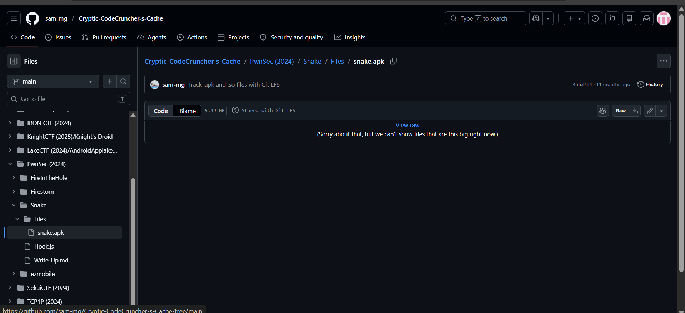

---

## 2. Décompilation et analyse statique avec Jadx

On importe l'APK dans **Jadx-GUI** pour examiner le code source Java décompilé.

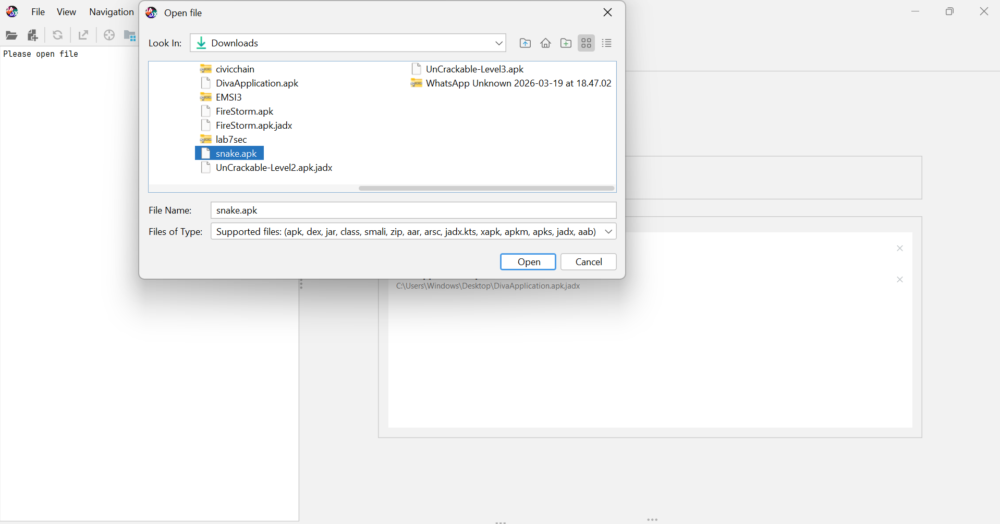

L'analyse de `MainActivity` révèle plusieurs points importants. D'abord, la présence de méthodes anti-root qui vérifient l'environnement d'exécution.

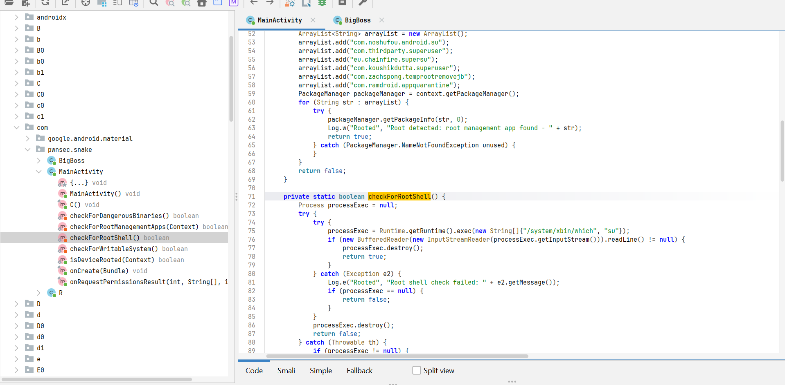

La méthode principale `C()` contient le flux d'exécution critique : si l'application reçoit un Intent avec l'extra `SNAKE=BigBoss`, elle tente de lire le fichier `/sdcard/Snake/Skull_Face.yml` et le désérialise via SnakeYAML.

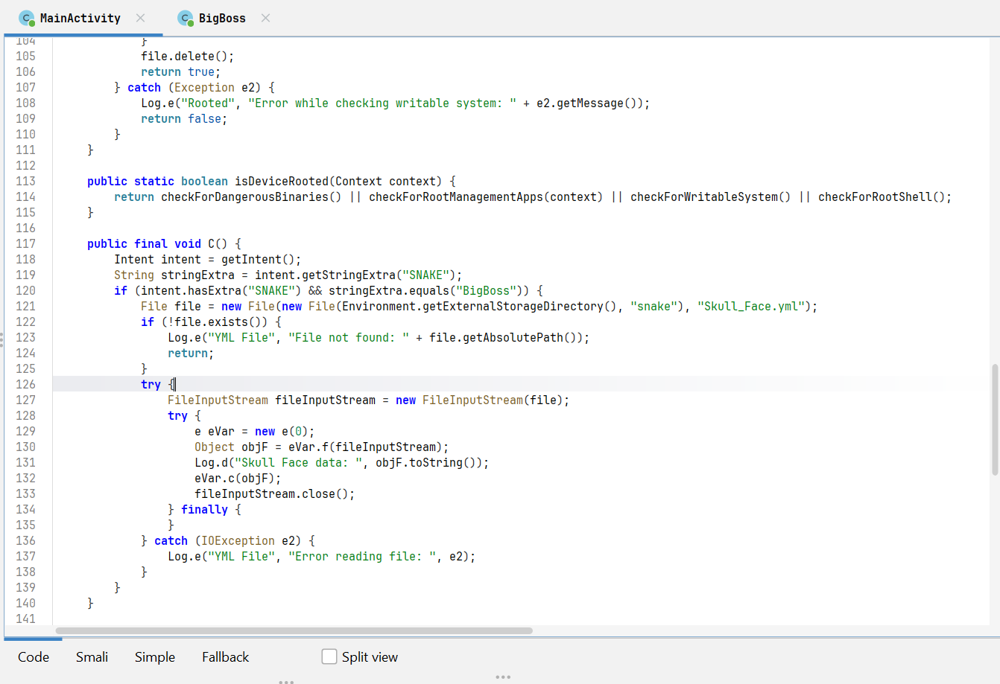

---

## 3. Décompilation Smali avec apktool

Pour modifier le bytecode, on décompile l'APK avec apktool :

```powershell
java -jar apktool_3.0.1.jar d snake.apk -o snake_smali_clean
```

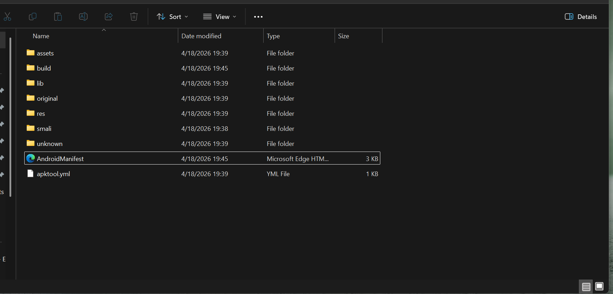

---

## 4. Modification du code Smali

### 4.1 Neutralisation de isDeviceRooted()

La méthode `isDeviceRooted()` enchaîne plusieurs vérifications anti-root. On remplace son contenu pour qu'elle renvoie systématiquement `false` :

```smali
.method public static isDeviceRooted(Landroid/content/Context;)Z
    .registers 1
    const/4 v0, 0x0
    return v0
.end method
```

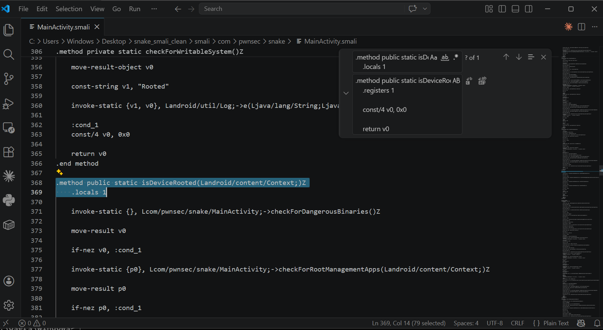

### 4.2 Correction du chemin de lecture du fichier YAML

Le chemin d'accès au fichier YAML doit pointer vers `/sdcard/Snake/Skull_Face.yml`. On modifie le registre dans le Smali pour utiliser `"Snake"` avec la majuscule correcte :

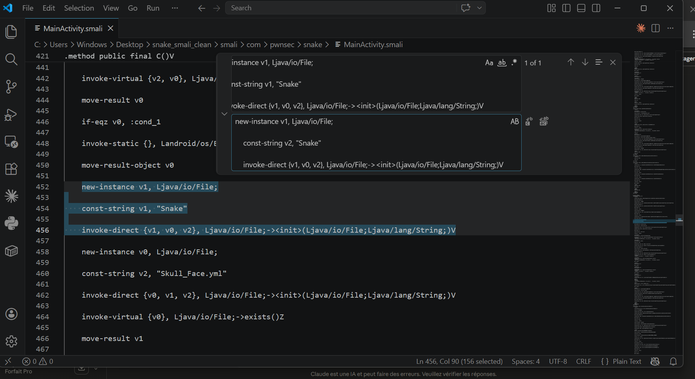

---

## 5. Modification du AndroidManifest.xml

On active le paramètre `extractNativeLibs` pour permettre l'extraction correcte des bibliothèques natives :

```xml
android:extractNativeLibs="true"
```

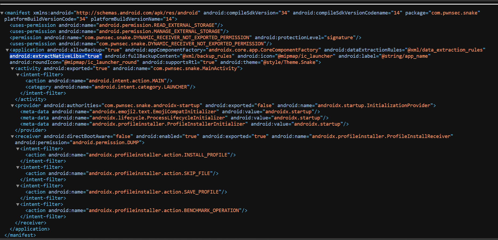

---

## 6. Recompilation, alignement et signature

```powershell
# Recompilation
java -jar apktool_3.0.1.jar b snake_smali_clean -o snake_patched.apk

# Alignement
zipalign -f -v 4 snake_patched.apk snake_final.apk

# Signature
apksigner sign --ks my-key.jks --out snake_signed.apk snake_final.apk
```

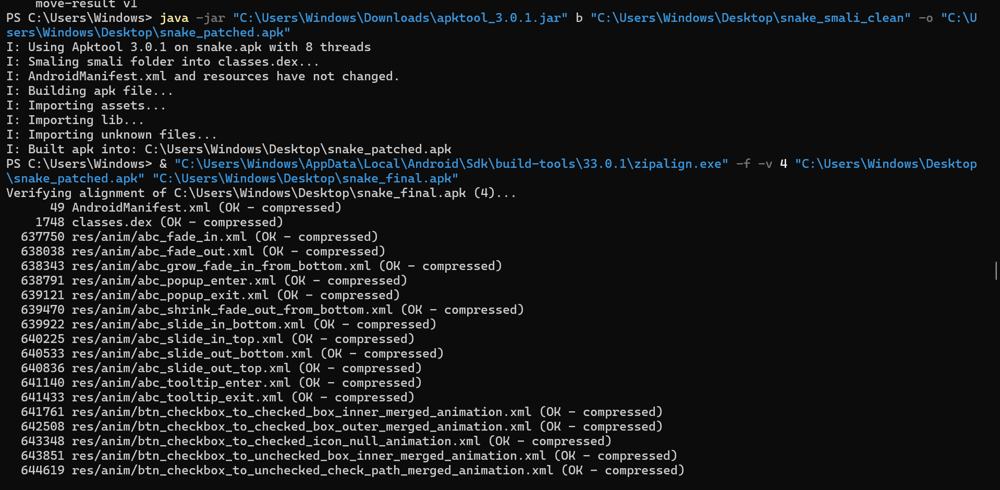

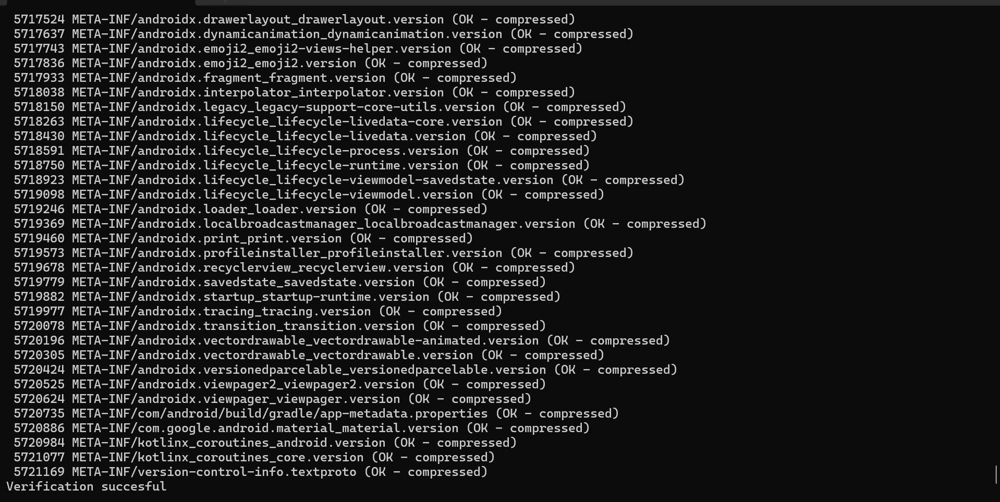

---

## 7. Installation sur l'émulateur

On installe l'APK patché sur l'émulateur Pixel 3 API 28 :

```powershell
adb install snake_signed.apk
```

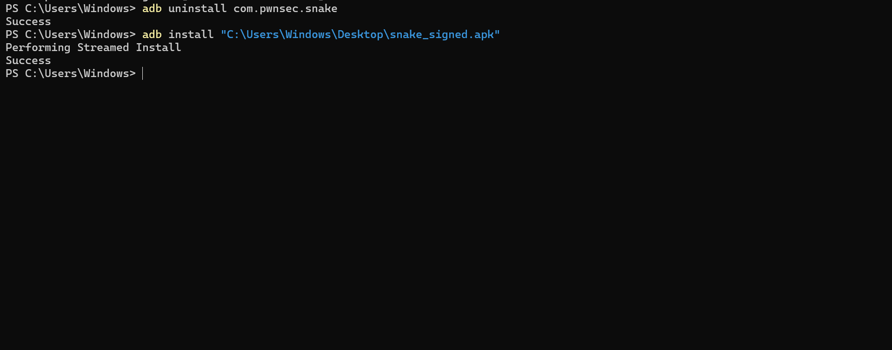

L'application apparaît bien dans la liste des applications de l'émulateur.

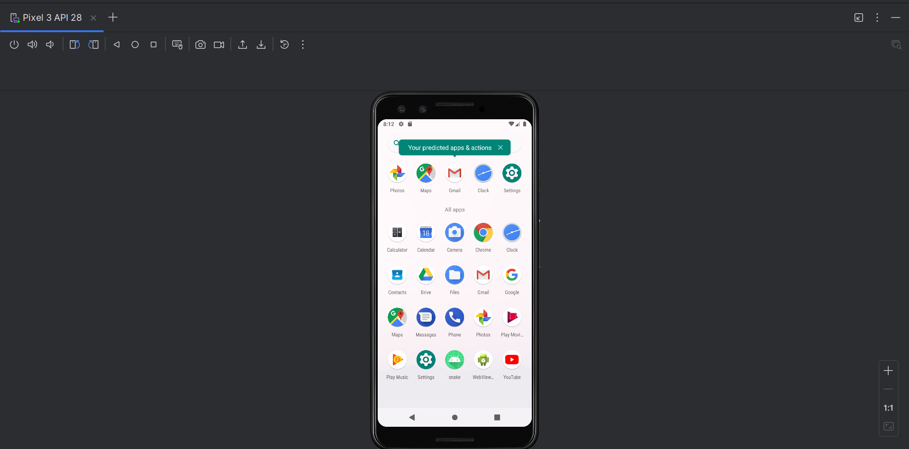

---

## 8. Création et déploiement du payload YAML

On crée le fichier `Skull_Face.yml` qui exploite la désérialisation non sécurisée de **SnakeYAML 1.33** (CVE-2022-1471). Ce payload force l'instanciation de la classe `BigBoss` lors du parsing :

```yaml
!!com.pwnsec.snake.BigBoss ["Snaaaaaaaaaaaaaake"]
```

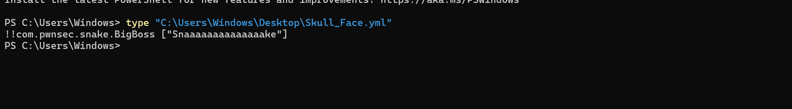

```powershell
# Création du dossier et copie du fichier
adb shell mkdir -p /sdcard/Snake
adb push Skull_Face.yml /sdcard/Snake/Skull_Face.yml

# Permission de lecture du stockage externe
adb shell pm grant com.pwnsec.snake android.permission.READ_EXTERNAL_STORAGE
```

---

## 9. Lancement et capture du flag

On déclenche l'exécution via un Intent ADB avec l'extra requis :

```powershell
adb shell am start -n com.pwnsec.snake/.MainActivity -e SNAKE BigBoss
adb logcat -d | Select-String -Pattern "PWNSEC|BigBoss"
```

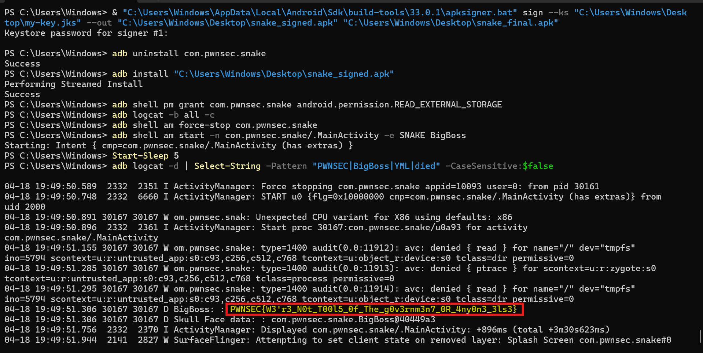

---

## Flag

```
PWNSEC{W3'r3_N0t_T00l5_0f_The_g0v3rnm3n7_0R_4ny0n3_3ls3}
```

---

## Notions abordées

**CVE-2022-1471** — La bibliothèque SnakeYAML en version antérieure à 2.0 permet l'instanciation arbitraire de classes Java via le constructeur `new Yaml()`. En insérant un tag global `!!nom.de.classe` dans un fichier YAML, on force la désérialisation d'un objet de la classe cible, ce qui déclenche l'appel de son constructeur et donc l'exécution de code Java arbitraire.

**Smali patching** — Le bytecode Dalvik (.smali) peut être modifié directement après décompilation avec apktool, ce qui permet de bypasser des contrôles de sécurité sans accès au code source original.
